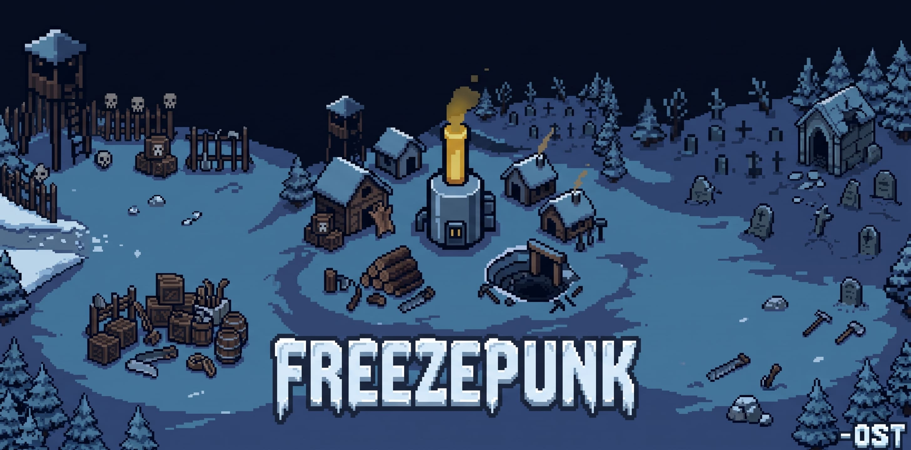
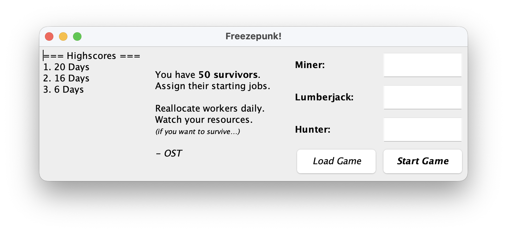
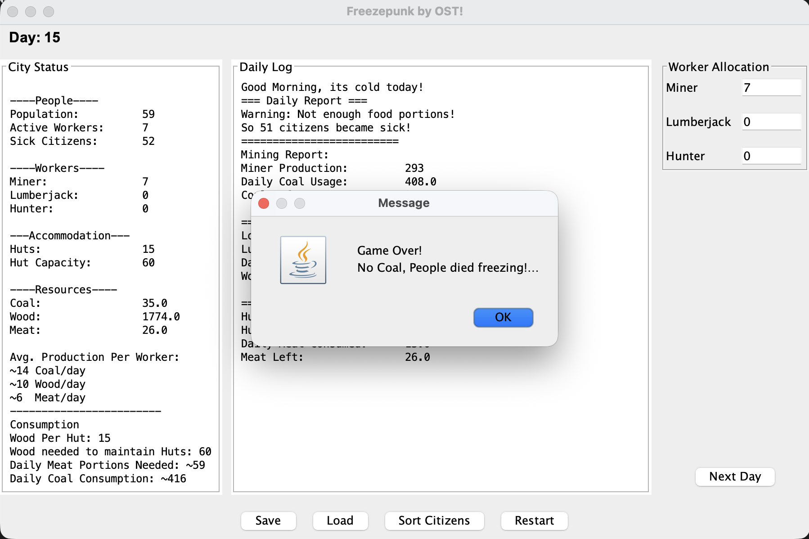

# ❄️ Freezepunk


**Freezepunk** is a lightweight, turn-based survival and resource-management game inspired by *Frostpunk*. You lead a settlement of **50 survivors** through an ever-worsening winter, balancing daily labor allocation across coal mines, forests, and hunting grounds to keep the generator running and your people alive.

> *This interactive UI project was originally developed during the Object-Oriented Programming (Programmierung 2) course at HTW Dresden and has been refactored to be published.*

---

## 📸 Screenshots 

### Start Window & Highscores

 

### Main Simulation & Daily Log
 


---

## 🎮 How the Simulation Works (Core Loop)

Every turn represents **one day** in the frozen wasteland. Before advancing to the next day, the player must allocate all healthy, active citizens across three vital roles:

| Role | Daily Output (Expected) | Food Consumption | Primary Purpose |
| --- | --- | --- | --- |
| ⛏️ **Miner** | `11 – 17` Coal (**~14.0/day**) | `1.2 – 1.8` Meat (**~1.5/day**) | Keeps the city warm; running out of Coal triggers **Game Over**. |
| 🪓 **Lumberjack** | `5 – 15` Wood (**~10.0/day**) | `0.7 – 1.3` Meat (**~1.0/day**) | Builds shelters (`15 Wood` per hut, fits `4 citizens`) and maintains them. |
| 🏹 **Hunter** | `5 – 7` Meat (**~6.0/day**) | `0.7 – 1.3` Meat (**~1.0/day**) | Feeds the population; starving citizens immediately fall sick. |

### ⚠️ Dynamic Hazards & Escalation

* **The Cold Gets Worse:** Daily coal consumption scales dynamically with both population ($N$) and the current day ($d$), plus stochastic weather variance:

$$\text{Coal}_{\text{daily}}(N, d) = 4N + 12d + \mathcal{U}(-10, 10)$$

* **Shelter Maintenance (Day 6+):** Starting on Day 6, harsh winds wear down infrastructure, requiring `4 Wood/day` per hut. If wood stocks fail to cover repairs, a hut collapses—leaving citizens homeless and spiking the daily sickness probability from **5%** to **24%**.
* **Sickness & Recovery:** Sick citizens cannot work (`0` output), consume extra food (`1.0 – 2.0` portions), and require `1 – 3 days` to recover.
* **Survivor Waves (Every 10 Days):** Every 10th day, a group of `8 – 16` exhausted, sick survivors arrives at the gates—suddenly increasing coal and food demand before they can heal and contribute to the workforce.

---

## 📊 Mathematical Game Balance & Survival Curve

Rather than using arbitrary numbers, Freezepunk's economy is modeled around a **stochastic equilibrium** designed to create a fair learning curve with a tense mid-game crisis on **Day 10**:

1. **Markov Steady-State Workforce:** With a base daily sickness rate of $p = 0.05$ and an expected recovery duration of $\tau = 2.0$ days, a well-managed city of $N = 50$ citizens reaches a steady-state expectation of:

$$E[\text{Sick}] = N \cdot \frac{p \cdot \tau}{1 + p \cdot \tau} \approx 4.5 \text{ sick citizens} \implies \mathbf{45.5 \text{ active workers/day}}$$

2. **Workforce Budget vs. Player Skill:** Starting stocks (`400 Coal`, `200 Wood`, `140 Meat`) act as an early-game buffer while the player learns the mechanics.

| Player Profile | Typical Strategy | Expected Survival | Cause of Defeat |
| --- | --- | --- | --- |
| **Casual / New** | Static or unbalanced worker allocation; ignores Day 6 hut repair costs. | **5 – 7 Days** | Hut collapse triggers a homelessness epidemic, depleting the 400 Coal buffer. |
| **Average** | Maintains day-to-day equilibrium (~19 Miners, ~6 Lumberjacks, ~11 Hunters) but fails to stockpile reserves during Days 2–5. | **9 – 11 Days** | **The Day 10 Survivor Wave** (+12 sick citizens) spikes coal demand to ~368/day, exhausting reserves. |
| **Veteran** | Exploits the repair-free window (Days 2–5) to heavily stockpile Coal & Wood, absorbing the Day 10 wave to expand the workforce to 62+. | **18 – 24 Days** | **The Great Frost:** By Day 20+, daily temperature penalties (`12 × day`) push coal demand past the maximum output of the healthy workforce. |

---

## 🏗️ Architecture & OOP Design

The project is structured into four distinct packages under `src/game/` to separate domain logic from the Swing presentation layer:

```text
freezepunk/
├── assets/                  # UI screenshots and gameplay media
├── lib/                     # JUnit testing dependencies
├── src/
│   └── game/
│       ├── except/          # Custom checked exceptions (GameOver)
│       ├── gui/             # Swing views & event handlers (StartWindow, GameWindow)
│       ├── model/           # Core domain entities (City, Citizen, Resource & subclasses)
│       ├── test/            # JUnit 5 test suite (CityTest)
│       └── Main.java        # Application entry point
├── .gitignore
├── LICENSE
└── README.md
```

* **Abstraction & Inheritance:**
    * `Citizen` (abstract) defines shared health state, recovery logic, and base food consumption, while subclasses (`Miner`, `Lumberjack`, `Hunter`) implement polymorphic `produce()` and `eat()` behaviors.
    * `Resource` (abstract) encapsulates type-safe resource quantities, extended by `Coal`, `Wood`, and `Meat`.

* **Natural Ordering (`Comparable`):** `Citizen` implements `Comparable` to sort the population alphabetically by job role first, and by health status second (healthy workers precede sick citizens)—accessible directly in the UI via the **Sort Citizens** action.
* **State Persistence (`Serializable`):** Both the entire `City` object graph (`fpGameSave.dat`) and the top-8 leaderboard (`highscore.dat`) are persisted locally using Java Object Serialization with `try-with-resources` stream management.
* **Unit Testing (JUnit 5):** `CityTest` verifies initial population invariants, worker reallocation accuracy, daily coal consumption, and `GameOver` exception triggers under resource depletion.

---

## 🚀 Getting Started

### Prerequisites

* **Java Development Kit (JDK):** Version 17 or higher (uses modern `Random.nextInt(origin, bound)` APIs).

### Running the Game

1. **Clone the repository:**
```bash
git clone https://github.com/onuross/freezepunk.git
cd freezepunk
```

2. **Compile and run via terminal:**
```bash
javac -d bin src/game/except/*.java src/game/model/*.java src/game/gui/*.java src/game/Main.java
java -cp bin game.Main
```

3. **Or open in VS Code / IntelliJ IDEA / Eclipse:**
Open the project folder and run `src/game/Main.java` directly.

---

## 📜 License

Distributed under the **MIT License**. See [LICENSE](LICENSE) for more information.

Developed by **([@onuross](https://github.com/onuross) / OST)**.
